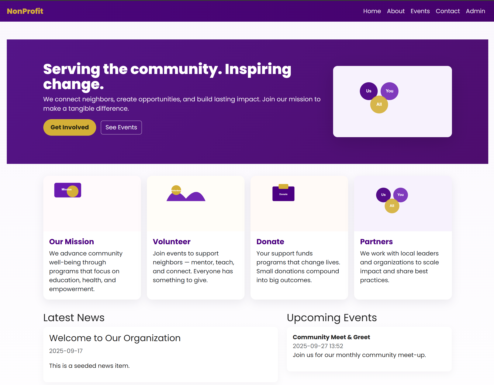

# JMU-CIS-AI-Website
This was a sample repository built for a guest lecture on using GitHub Copilot to build Websites using ASP.NET.  This is NOT meant to be a prodution ready application.  It's simply meant to serve as an example of how quickly you could get started with just a few prompts with GitHub Copilot.

There is a [requirements document](REQUIREMENTS.md) that was fed to GitHub Copilot to originally create this website.  I then used GitHub Copilot to further refine the application.  The full transcript of my prompts and questions with GitHub Copilot can be found below,

* [Full GitHub Copilot Transcript](COPILOT_TRANSCRIPT.md)

Additionally, its really helpful to understand how to leverage GitHub Codespaces and port forwarding so that you can rapidly test your website without building the software locally on your machine.  More details can be found below,

* [Port Forwarding with GitHub Codespaces](https://docs.github.com/en/codespaces/developing-in-a-codespace/forwarding-ports-in-your-codespace)

* Below is what the website looks like after being created by GitHub Copilot.

